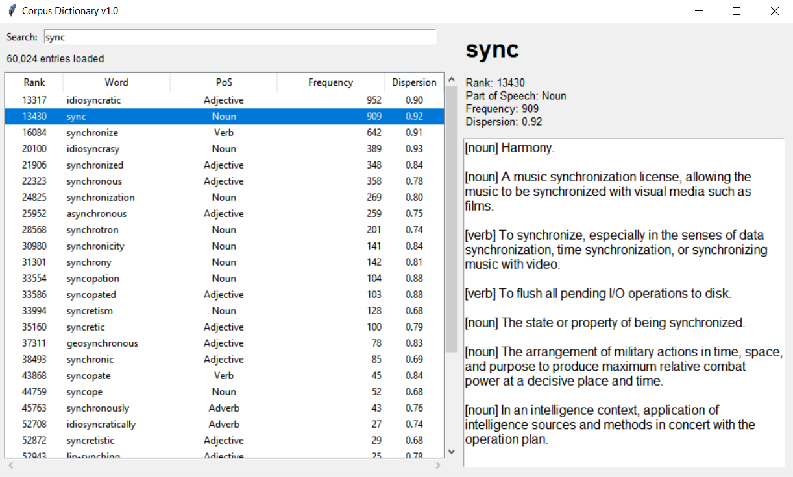

# Corpus-Dictionary v1.0

English language data base and dictionary. The data set is cut to the first 5000 entries due to legal reasons from the source.

corpus_dictionary/\
├── READ ME.txt\
├── data/\
│   └── dictionary.txt\
├── dictionary.py\
├── dictionary_screenshot.png\
└── run.bat	# Run this to start

