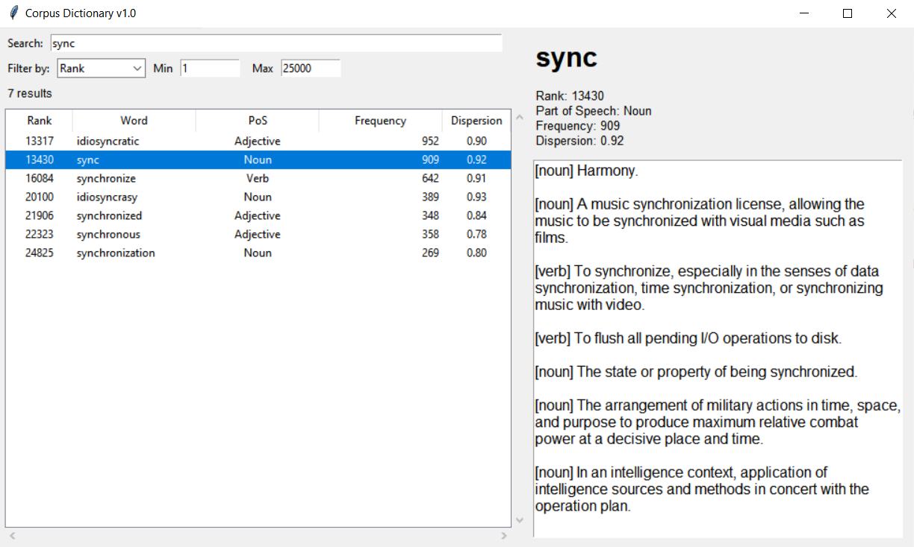

# Corpus-Dictionary

English language data base and dictionary. The data set is cut to the first 5000 entries due to legal reasons from the source.

Data set is from www.wordfrequency.info \
Dictionary API is from www.dictionaryapi.dev

corpus_dictionary/\
├── .git/\
├── READ ME.txt\
├── Run.bat	# Run this to start\
├── corpus_dictionary_screenshot.png\
├── data/\
│   ├── dictionary.txt\
│   └── flagged_ranks.txt\
├── dictionary.py\
└── icon.ico

